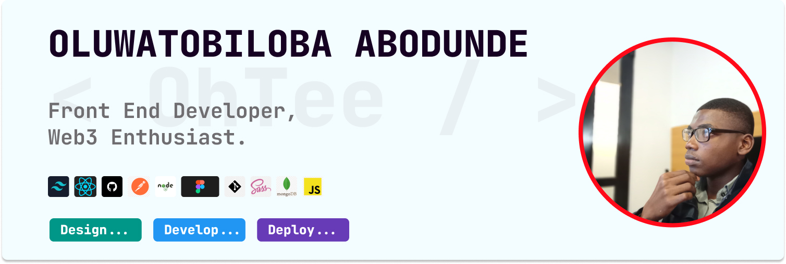

### WELCOME TO MY SPACE!...😎

 
   <strong> <i> Visitor count </i> 🤫 <strong>
    
  

# Hi👋, I'm Tobi👨‍💻

## 
 A passionate Frontend Developer 👩‍💻 from Nigeria 🇳🇬 who is currently learning about Web3 

#### ABOUT ME 💡
Being a Mechanical Engineering Finalist skilled in Mechanical CAD softwares (SolidWorks, Fusion360, AutoCAD), I'm a rapidly advancing front-end web developer with a passion for crafting exceptional user interfaces that drive results. With a strong foundation in HTML, CSS, and JavaScript, I'm honing my skills so as to be a master of my craft, always trying to stay ahead of the curve with the latest technologies and frameworks like TailwindCSS, ReactJS.

 As a web3 enthusiast, I'm fascinated by the potential of blockchain technology to revolutionize the web and eager to contribute to the development of decentralized applications and protocols. With a deep commitment to using technology for social good, I aim to create innovative solutions that improve people's lives, foster inclusivity, and promote digital accessibility. 

If I’m not designing, developing or deploying any web app then I'm probably doing some Mechanical CAD Designs. 

 After a brief hiatus, I'm back and ready to take on new challenges, fueled by my unwavering dedication to delivering high-impact solutions. 

<i> Check out my repositories to see what I'm working on, and feel free to connect with me! </i>
  

<table align="center">
   <tr>
      <td>
         <h3>GET IN TOUCH:</h3>
         <ul>
            <li>🌐 Find My Live Projects <a href="https://sagarviradiya.dev">Here</a></li>
            <li>❌ Follow Me on <a href="https://x.com/_OhTee_">Twitter</a></li>
            <li>✍️ I document and share things I learn on <a href="https://medium.com/@sagarviradiya">Medium</a></li>
            <li>🔗 Common! Lets Connect on <a href="https://www.linkedin.com/in/oluwatobiloba-abodunde-4312a322a/">LinkedIn</a></li>
            <li>🎓 Check my CERTIFICATIONS <a href="#">Here</a></li>
         </ul>
      </td>
      <td>
         <h3>GET IN TOUCH:</h3>
         <ul>
            <li>🌐 Find My Live Projects <a href="https://sagarviradiya.dev">Here</a></li>
            <li>❌ Follow Me on <a href="https://x.com/_OhTee_">Twitter</a></li>
            <li>✍️ I document and share things I learn on <a href="https://medium.com/@sagarviradiya">Medium</a></li>
            <li>🔗 Common! Lets Connect on <a href="https://www.linkedin.com/in/oluwatobiloba-abodunde-4312a322a/">LinkedIn</a></li>
            <li>🎓 Check my CERTIFICATIONS <a href="#">Here</a></li>
         </ul>
      </td>
   </tr>
</table>

#### <bold>GET IN TOUCH:</bold>

- 🌐 Find My Live Projects [Here](https://sagarviradiya.dev)
- ❌ Follow Me on [Twitter](https://x.com/_OhTee_)
- ✍️ I document and share things I learn on [Medium](https://medium.com/@sagarviradiya)
- 🔗 Common! Lets Connect on [LinkedIn](https://www.linkedin.com/in/oluwatobiloba-abodunde-4312a322a/)
- 🎓 Check my CERTIFICATIONS [Here](#)
    

#### <strong>⚙️TOOLS & LANGUAGES I USE🛠️</strong>
<table>
  <tr>
    <td>
      
    </td>
    <td>
      
    </td>
    <td>
      
    </td>
    <td>
      
    </td>
    <td>
      
    </td>
    <td>
      
    </td>
    <td>
      
    </td>
    <td>
      
    </td>
    <td>
      
    </td>
  </tr>
</table>
 
 

 

#### <strong>PROJECTS:</strong>

- 🌱 Contributed to i2talk chat app during TIIDELab fellowship. [See demo here](#)
- 🌱 Contributed to ZC main and ZC company sales prospect during HNGi8. [See demo here](#)
- 🌱 Resource edge task as a standardization test under Learnable '21. [See demo here](#)
- 🌱 Decipher app, a choice maker app. [See demo here](#)
- 🌱 A simple portfolio site with HTML and CSS. [See demo here](#)
- 🌱 Bookmark landing page challenge from Frontend Mentor. [See demo here](#)
- 🌱 HackerNews website replica fetching news data from their API. [See demo here](#)
   

<table align="center">
   <tr>
      <td>
         

   

      </td>
      <td>
         

   

      </td>
   </tr>
</table>

  

<!--
**OhTobiloba/OhTobiloba** is a ✨ _special_ ✨ repository because its `README.md` (this file) appears on your GitHub profile.

Here are some ideas to get you started:

- 🔭 I’m currently working on ...
- 🌱 I’m currently learning ...
- 👯 I’m looking to collaborate on ...
- 🤔 I’m looking for help with ...
- 💬 Ask me about ...
- 📫 How to reach me: ...
- 😄 Pronouns: ...
- ⚡ Fun fact: ...
-->
